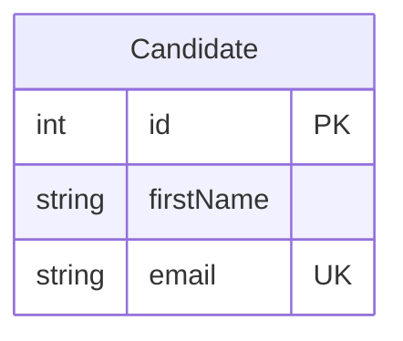

# Estándares de Documentación — LTI Talent Tracking System

## Principio Fundamental

La documentación técnica es parte del entregable, no un extra opcional. Un commit sin documentación actualizada está incompleto.

## Cuándo Actualizar Documentación

| Tipo de cambio en código | Documentación a actualizar |
|--------------------------|---------------------------|
| Nueva entidad en Prisma schema | `docs/modelo-datos.md` |
| Migración de base de datos | `docs/modelo-datos.md` |
| Nuevo endpoint de API | `docs/api-spec.yml` |
| Cambio en endpoint existente | `docs/api-spec.yml` |
| Nuevo paquete/librería instalada | Sección correspondiente en `docs/backend-standards.md` o `docs/frontend-standards.md` |
| Cambio en proceso de desarrollo | `docs/guia-desarrollo.md` |
| Nuevo agente o skill | Entrada en `CLAUDE.md` |

## Formato de Documentación

### Markdown

Toda la documentación se escribe en Markdown. Seguir estas convenciones:
- Encabezados: `#` para título principal, `##` para secciones, `###` para subsecciones
- Código siempre en bloques con lenguaje especificado: ` ```typescript ` 
- Tablas para comparaciones y referencias
- Listas numeradas para pasos secuenciales, listas con bullet para items no ordenados

### Idioma

- Toda la documentación en **castellano**
- Los identificadores de código (nombres de variables, funciones, etc.) permanecen en inglés
- Los fragmentos de código en los docs están en inglés (es código real)

## Guía para `docs/modelo-datos.md`

Al añadir o modificar una entidad, documentar:

```markdown
## [NombreEntidad]

**Descripción:** Qué representa esta entidad en el dominio del negocio.

**Tabla en BD:** `nombre_tabla` (Prisma schema: `NombreEntidad`)

| Campo | Tipo | Obligatorio | Descripción | Validaciones |
|-------|------|-------------|-------------|--------------|
| id | Int | Sí (auto) | Identificador único | Auto-increment |
| email | String | Sí | Email del candidato | Formato email, único |
| firstName | String | Sí | Nombre | 1-100 caracteres |

**Relaciones:**
- `[NombreEntidad]` tiene muchos `[OtraEntidad]` → Campo `otraEntidadId`

**Diagrama Mermaid:**

```

## Guía para `docs/api-spec.yml`

Al añadir un endpoint, documentar en formato OpenAPI 3.0:

```yaml
paths:
  /api/candidates:
    post:
      summary: Añadir un nuevo candidato al sistema
      tags: [Candidates]
      requestBody:
        required: true
        content:
          multipart/form-data:
            schema:
              $ref: '#/components/schemas/CreateCandidateRequest'
      responses:
        '201':
          description: Candidato creado correctamente
          content:
            application/json:
              schema:
                $ref: '#/components/schemas/CandidateResponse'
        '400':
          description: Datos inválidos
        '409':
          description: El email ya existe
        '500':
          description: Error interno del servidor
```

## Estructura del Proceso de Spec Driven Development

### Ciclo de Vida de una Tarea

```
Historia de Usuario (Jira/ticket)
         ↓
Enriquecimiento (skill /enriquecer-historia)
         ↓
Spec detallada en specs/[feature]/
  ├── feature.md       (qué es el feature y por qué)
  ├── requirements.md  (requisitos detallados)
  ├── tasks-backend.md (plan técnico backend)
  └── tasks-frontend.md (plan técnico frontend)
         ↓
Planificación revisada por el desarrollador humano
         ↓
Implementación (siguiendo tasks-backend/frontend.md)
         ↓
Tests + Reporte en specs/[feature]/reportes/
         ↓
Actualización de docs/ afectados
         ↓
Commit con skill /commit
         ↓
Pull Request
```

### Directorio specs/

Cada feature tiene su carpeta en `specs/`:
```
specs/
└── anadir-candidato/
    ├── feature.md
    ├── requirements.md
    ├── tasks-backend.md
    ├── tasks-frontend.md
    └── reportes/
        ├── YYYY-MM-DD-tests-unitarios-backend.md
        └── YYYY-MM-DD-tests-e2e-frontend.md
```

Una vez completado el feature y mergeado a main, la carpeta `specs/[feature]/` se mantiene como registro histórico.

## Proceso de Aprendizaje Continuo

Después de cada feature completado, si encuentras que los estándares son imprecisos o incompletos:
1. Propón la mejora al equipo
2. Actualiza el documento de estándares correspondiente
3. Documenta el cambio en el commit con tipo `docs`

Esto garantiza que la documentación evoluciona con el proyecto y sigue siendo útil para el equipo y los agentes de IA.
