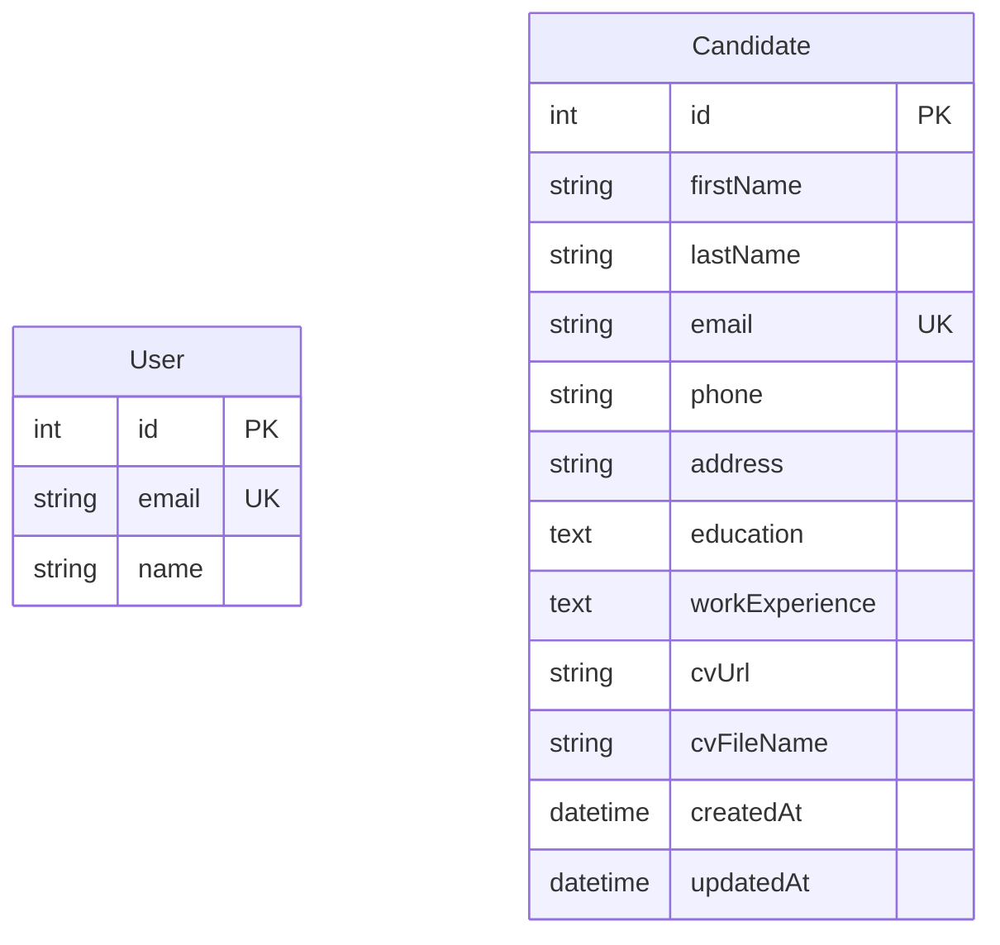

# Modelo de Datos — LTI Talent Tracking System

Este documento describe todas las entidades del modelo de datos del sistema LTI, sus campos, validaciones y relaciones.

**Base de datos:** PostgreSQL  
**ORM:** Prisma v5.13.0  
**Schema file:** `backend/prisma/schema.prisma`

---

## Entidades Implementadas

### Candidate *(implementado en SCRUM-01)*

**Descripción:** Candidato que participa en los procesos de selección gestionados por el sistema ATS. Es la entidad central del sistema.

**Tabla en BD:** `Candidate`

| Campo | Tipo Prisma | Obligatorio | Descripción | Validaciones |
|-------|-------------|-------------|-------------|--------------|
| id | Int | Sí (auto) | Identificador único | Autoincrement, PK |
| firstName | String | Sí | Nombre del candidato | 1-100 caracteres, no vacío |
| lastName | String | Sí | Apellido del candidato | 1-100 caracteres, no vacío |
| email | String | Sí | Email del candidato | Formato email válido, único |
| phone | String? | No | Teléfono de contacto | Formato internacional: `+[código] [número]`. Dígitos totales: 7-15. Chars permitidos: dígitos, espacios, `+`, `-`, `(`, `)` |
| address | String? | No | Dirección postal | Máx 500 caracteres |
| education | String? | No | Historial educativo | Texto libre, máx 5000 chars |
| workExperience | String? | No | Experiencia laboral | Texto libre, máx 5000 chars |
| cvUrl | String? | No | Ruta local del CV subido | Path al archivo en servidor |
| cvFileName | String? | No | Nombre original del CV | Para mostrar al usuario |
| createdAt | DateTime | Sí (auto) | Fecha de creación | Default: now() |
| updatedAt | DateTime | Sí (auto) | Fecha de última modificación | Actualiza automáticamente |

**Reglas de Negocio:**
- El email es único en el sistema (no pueden existir dos candidatos con el mismo email)
- El CV debe ser PDF o DOCX, máximo 10 MB
- `firstName`, `lastName` y `email` son los únicos campos obligatorios
- El salario y otros campos de proceso de selección son responsabilidad de entidades relacionadas futuras

**Relaciones Futuras:**
- `Candidate` tendrá muchas `Application` (postulaciones a posiciones)
- `Candidate` tendrá muchos `Interview` (entrevistas programadas)

**Schema Prisma:**
```prisma
model Candidate {
  id             Int      @id @default(autoincrement())
  firstName      String   @db.VarChar(100)
  lastName       String   @db.VarChar(100)
  email          String   @unique @db.VarChar(255)
  phone          String?  @db.VarChar(20)
  address        String?  @db.VarChar(500)
  education      String?  @db.Text
  workExperience String?  @db.Text
  cvUrl          String?  @db.VarChar(500)
  cvFileName     String?  @db.VarChar(255)
  createdAt      DateTime @default(now())
  updatedAt      DateTime @updatedAt
}
```

---

### User

**Descripción:** Usuario básico del sistema. Entidad placeholder del boilerplate inicial.

**Tabla en BD:** `User`

| Campo | Tipo Prisma | Obligatorio | Descripción |
|-------|-------------|-------------|-------------|
| id | Int | Sí (auto) | Identificador único, autoincrement |
| email | String | Sí | Email del usuario, único en el sistema |
| name | String? | No | Nombre del usuario |

**Estado:** Entidad inicial del boilerplate. Pendiente de evolucionar según los requisitos del sistema de autenticación.

---

## API Endpoints Implementados

### POST /api/candidates

Crea un nuevo candidato en el sistema.

**Request:** `multipart/form-data`

| Campo | Tipo | Obligatorio | Notas |
|-------|------|-------------|-------|
| firstName | string | Sí | |
| lastName | string | Sí | |
| email | string | Sí | Debe ser email válido y único |
| phone | string | No | Formato: `+[código_país] [número_local]` (ej: `+34 612345678`). Generado por `PhoneField` en el frontend. |
| address | string | No | |
| education | string | No | |
| workExperience | string | No | |
| cv | File | No | PDF o DOCX, máx 10 MB |

**Respuestas:**
- `201` — Candidato creado: `{ success: true, data: Candidate }`
- `400` — Datos inválidos: `{ success: false, error: "..." }`
- `409` — Email duplicado: `{ success: false, error: "Ya existe un candidato con el email ..." }`
- `500` — Error interno: `{ success: false, error: "Error interno del servidor" }`

---

### GET /api/candidates/suggestions

Devuelve sugerencias de autocompletado basadas en datos preexistentes del campo indicado.

**Query params:**

| Param | Tipo | Obligatorio | Notas |
|-------|------|-------------|-------|
| field | `education` \| `workExperience` | Sí | Campo a sugerir |
| q | string | No | Texto de búsqueda (case-insensitive). Si está vacío, devuelve los primeros resultados |

**Respuestas:**
- `200` — Lista de sugerencias: `{ success: true, data: string[] }` (máx 6 elementos)
- `400` — Campo inválido: `{ success: false, error: "El parámetro field debe ser..." }`
- `500` — Error interno

**Implementación:** `Candidate.findSuggestions()` utiliza `prisma.candidate.findMany` con `distinct` para evitar duplicados.

---

## Diagrama Entidad-Relación (Estado Actual)



---

## Guía de Migraciones

Para añadir o modificar entidades:

```bash
# 1. Modificar backend/prisma/schema.prisma
# 2. Crear y ejecutar migración
cd backend
npm run prisma:migrate
# Cuando pida nombre: describir el cambio (ej: add_candidate_model)
# 3. Regenerar Prisma client
npm run prisma:generate
# 4. Reiniciar el servidor de desarrollo
```

Las migraciones se guardan en `backend/prisma/migrations/` y se versionan en Git.
